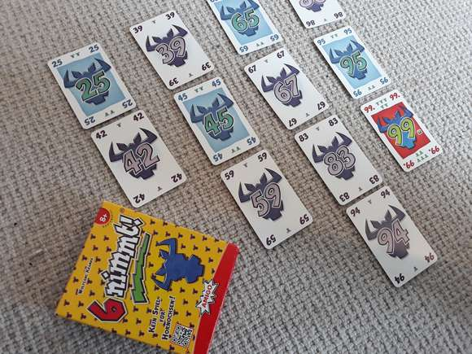
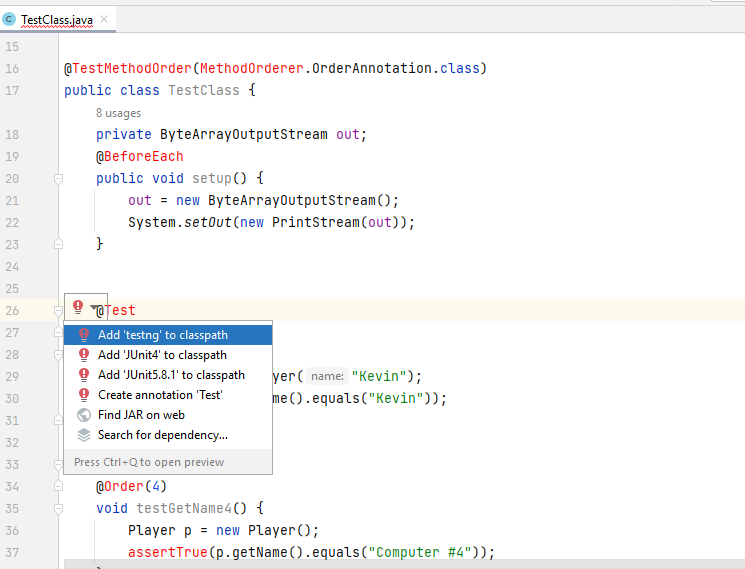
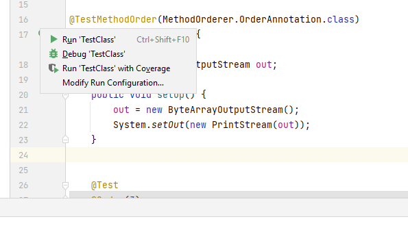
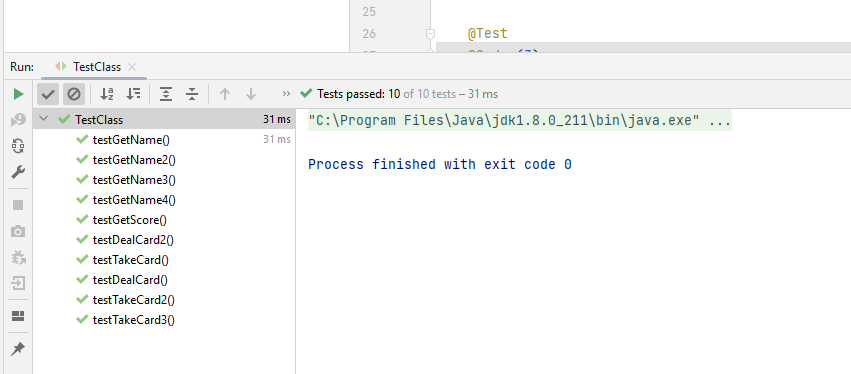
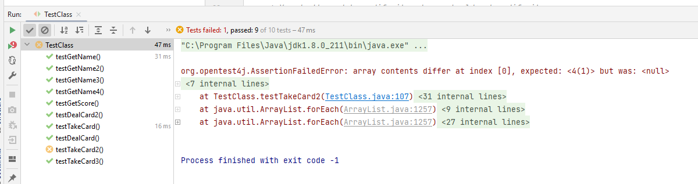

# COMP2026/COMP2046 Programming Assignment 2 - 6 nimmt!

## 2022-23 Semester 1

* Designed by: [Dr. Kevin Wang](mailto:kevinw@comp.hkbu.edu.hk)
* Assignment Website: [GitHub](https://github.com/khwang0/COMP2026-2223PA1)
* Due: 
  * UAT Due: 11:59pm (Monday midnight), 31st October, 2022
  * Programming Due: 11:59pm (Saturday midnight), 12th November, 2022
* Download the demo program: [here](demo.jar)
* Download everything from the assignment: [here](https://github.com/khwang0/COMP2026-2223PA2/archive/refs/heads/master.zip)

> To run the demo program, type the following in your terminal:
> 
> ```sh
> > java -jar demo.jar
> ```

> This assignment is a COMP2046/COMP2026 assignment. It does not count towards your COMP2045 grade. 

# Learning outcome

Students are expected to have some practices on object-oriented programming concepts/static variables/2D arrays/array resizing/method visibility in this assignment. We expect most students would spend 7 hours or more to finish the assignment without any assistance. Make sure you start as earlier as possible and ask us on Discord if you have any difficulty!

> Important: You are not allowed to use any advanced data structure or API such as `ArrayList`, `Arrays`, `List` to manipulate your arrays. You are expected to use just `new` and loops to manipulate your arrays. You are allowed, but not limited, to use methods from `String` class, `Integer` class and `Scanner` class.

# Introduction

You are going to complete the boardgame 6 nimmt! There are three main Java files: [Card.java](Card.java), [Player.java](Player.java), [Table.java](Table.java) in this project. A file that is used to test your work [TestClass.java](TestClass.java) is also given to you while this file does not need any modification. You need to complete the methods stated in the skeleton code. Make sure you can follow the instructions given at the top of each method.

A [sample program](demo.jar) is given to you. When there is something you are not sure, you can take a look at the sample program to decide what to do.

Some methods are labeled as completed or given. Please don't make any change on those methods. You are not supposed to modify them.

# Explanation of the game of 6 nimmt!



<sub><sup>image ref: https://boardgamebible.com/games/6-nimmt/</sup></sub>

> The rule of the game can be referred to the following links:
> * [YouTube video, in English](https://www.youtube.com/watch?v=ooNfiy6Nfpg)
> * [YouTube video, in Cantonese](https://www.youtube.com/watch?v=oQaYLUYuhwk)


## Rules adopted in the assignment

Please note the **bold word** below to get familiar with the terminology we used in this assignment.

* We will assume there are four **players** in this game.
* Each player will be first **dealt with 10 cards** to form their **hand cards**.
* The aim of the game is to minimize the **score** a player received.
* Scores are computed by adding the number of **bull heads** on each card of a player's **score pile (or just "pile")**.
* There are four **stacks** on the table. 
* Each turn player plays their card at the same time. These cards, in ascending order of their **number**, will be compared with the **top card** of each stack. Their card will be placed to the top of a correct stack, so that the **number** of top card of this stack is smaller than the **number** of the played card. In addition, if multiple stacks have top cards smaller than the played card, the stack with the largest top card will be selected.
* Whenever a stack has 6 cards, the player who play the 6th card will need to **move the entire stack** to his score pile.


# Skeleton code of the assignment

## `Card` class

This models a card. A card has a unique number `number` and a number of bull heads `bullHead`. The number of bullHead of each card is as follows:
* 1 card with 7 bull heads—number 55
* 8 cards with 5 bull heads—multiples of 11 (except 55): 11, 22, 33, 44, 66, 77, 88, 99
* 10 cards with 3 bull heads—multiples of ten: 10, 20, 30, 40, 50, 60, 70, 80, 90, 100
* 9 cards with 2 bull heads—multiples of five that are not multiples of ten (except 55): 5, 15, 25, 35, 45, 65, 75, 85, 95
* 76 cards with 1 bull head—the rest of the cards from 1 through 104

## `Player` class

This models a player object. A player has a name. A player has a hand of cards (maximum 10 cards) `hand`. The number of card on the player's hand is kept by a variable `handCount`. A player has a score pile of cards `pile`. This variable should be a dynamic array which will automatically resized to fit the number of cards it stores. A player object supports two different way to play a card. It can play a card randomly `playCardRandomly()` or `playCard()`. The latter method will show the hand to the player and ask the player to select a proper card. There are two given methods `printPile()` and `getHandCard(int)`. You should not change any of them or we may not be able to grade your work properly.

## `Table` class

This models the table object. A table contains four stacks of cards `stacks`. Each stack has at most 6 cards. A table has also four Player objects `players`. It controls the main logic of how the game play.


## `TestClass` class

You don't need to do anything with this java file. The purpose of this file is to conduct some *unit test* for your code. If you are using IntelliJ, you should be able to use this file within a few quick steps. By looking at this file, you should have some ideas of how the TA grade your work!

1. Open the file `TestClass.java`
2. Click on the word `@Test` at line 26.
   
4. Click the red bulb and select `Add JUnit-5.x.x to classpath`.
5. Click the arrow on the left of `public class TestClass` at line 17 and select `Run Tests`.
  
6. You shall see the following screen if there isn't any problem
  
7. Or you will see some error if your code does not perform what it is suppose to do.
  

> Note: If you are struggle with this file (e.g. cannot compile your code), simply delete this file. 

# Understanding the Assignment Test (UAT)

This part is independent to your programming code. You will need to answer the following short questions by **another due date**.
Submit your answers on Moodle. 

1. Assume the stacks on the table are: `Stack 0: [1, 4]`, `Stack 1: [10, 56]`, `Stack 2: [5]`, `Stack 3: [90, 91, 92, 95]`. Which stack should the card 44 be placed?
2. According to the demo program, which of the following action the program will do when the game is over?
   1. Print the scores of all players
   2. Say "Good bye"
   3. Ask the user to play again
   4. Crash
3. By which method a `Table` object can know a player's score (total number bull heads)?
4. If a computer player is forced to pick up a stack, according to the assignment description which stack the computer player should pick?


---

## Programming Style and Documentation 

Good programming style (indentation, comments) are always essential.  Blank lines, spaces between operators/variables (wherever appropriate) and meaningful variable names are required. Your program should be properly indented.  Good choice of variable names and method names is also essential.  Your program must have proper internal documentation.
Wherever necessary and appropriate, you should add inline comments to explain the execution flow of your program. You are required to remove the word TODO from your program before submission. Fail to do so will yield certain penalty. There are certain constant (final variables) in the program. Use them whenever possible.


# Submission 
For submission upload the file `Card.java`, `Table.java`, and `Player.java` to Moodle.  

Please be reminded that both the **Late Penalty Rule** and the **Penalty for Plagiarism** are applied strictly to all submissions of this course (including this assignment).   

### Late Penalty Rule

```java
if (lateHour > 0) {
    if (lateHour < 24) 
        mark *= 0.8;
    else if (lateHour < 48)
        mark = mark >> 1;
        else if (lateHour < 72)
            mark = mark >> 2;
            else
                mark &= 0;
}
```


 ## Plagiarism

 Plagiarism is a serious offense and can be easily detected. Please don't share your code to your classmate even if they are threatening you with your friendship. If they don't have the ability to work on something that can compile, they would not be able to change your code to a state that we can't detect the act of plagiarism. For the first commit of plagiarism, regardless you shared your code or copied code from others, you will receive 0 with an addition of 5 mark penalty. If you commit plagiarism twice, your case will be presented in the exam board and you will receive a F directly.

## Marking Scheme 
There are three elements in the marking scheme: 
* 5% - Understanding the Assignment Test (UAT)
* 90% - a working program that functions as specified 
* 5% - Programming style and documentation 
* -50% - if you define any extra class variable (field), addition class, change the method `main`, or change the visibility of any method. However, you can introduce some private method to help you resolve inner class logic.
* -30% - if you use forbidden API such as `ArrayList`, `List`, `Arrays`. If you have doubt, please consult Kevin before submission.

Please note that submitting a program that cannot be compiled would result in a very low mark. 

 

## Interview 
Should the teaching team see fit, students may be requested to attend an interview to explain about their program.  Students failing to attend such interview or to demonstrate a good understanding of their own program may result in mark deduction. 


